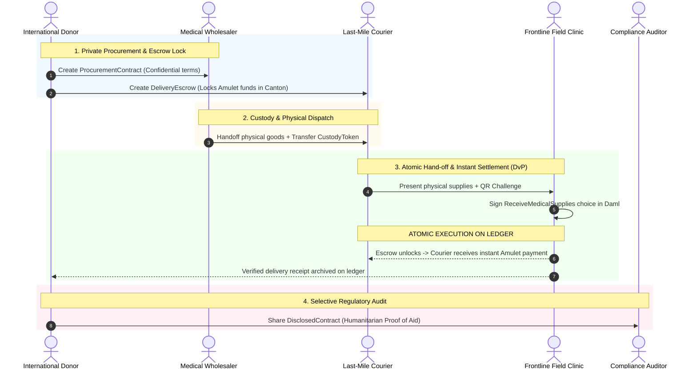

# Track N1 Submission: Confidential Humanitarian Medical Supply & Escrow Settlement in Contested Zones

**Challenge:** *What can you build on Canton that you cannot build on Ethereum?*  
**Track:** Track N1 (No-Code / Non-Technical Track)  
**Author / Team:** Tanzil | Clinician, Clinical Safety Officer & Regulatory Consultant  
**Format:** 3-Page Executive & Technical Brief  

---

## 1. Executive Summary & The Core Problem

In active conflict zones and high-risk humanitarian corridors (e.g., Eastern Europe, the Levant, Sub-Saharan Africa), delivering critical medical supplies—such as trauma surgical kits, blood plasma, portable anesthesia units, and cold-chain insulin—is plagued by three fundamental challenges:

1. **Severe Counterparty Distrust**: Donors, international NGOs, regional wholesalers, local military checkpoints, and underground field clinics operate in an environment with zero mutual trust.
2. **Operational Security & Targeting Risks**: Medical facilities in contested areas face deliberate targeting or looting. Any transparency that reveals supply volumes, delivery schedules, or recipient clinic locations creates military targeting vectors and black-market theft.
3. **Liquidity & Delivery Failure**: Last-mile local couriers operate under extreme physical danger. If payment is delayed, supply lines collapse; if payment is sent in advance, goods are frequently intercepted or diverted.

This paper presents **IronFlower (Tekkadan Protocol)**: a confidential, multi-party medical inventory tracking and milestone-escrow settlement architecture built on **Canton Network**. We demonstrate why this system is mathematically impossible to deploy on a centralized database or a public blockchain like Ethereum, and how Canton’s sub-transaction privacy and atomic multi-synchronizer composability uniquely solve the humanitarian supply crisis.

---

## 2. Why Existing Architectures Fail (The 3-Way Deadlock)

```
+---------------------------------------------------------------------------------------------------+
| Architecture       | Multi-Party Trust       | Operational Security & Privacy | Atomic DvP Escrow |
+--------------------+-------------------------+--------------------------------+-------------------+
| Centralized SQL    | ❌ Deadlocked           | ⚠️ Single Point of Failure     | ❌ Fragile / Slow |
| Ethereum (Public)  | ✅ Trust-Minimized      | ❌ Lethal Privacy Leak         | ⚠️ Public / Risky |
| Canton Network     | ✅ Multi-Node Consensus | ✅ Sub-Transaction Confidential| ✅ Atomic & Closed|
+--------------------+-------------------------+--------------------------------+-------------------+
```

### A. Why Centralized SQL (Postgres / Cloud) Breaks Down
* **Hostility & Sovereign Jurisdiction**: An international NGO (e.g., MSF) cannot host a centralized database because local belligerents or hostile state actors can subpoena, raid, or cyber-attack the server to locate underground field hospitals.
* **Trust Asymmetry**: International donors (e.g., USAID, ECHO) will not deposit escrow funds into a regional government’s or local wholesaler's private database without independent cryptographic auditability.

### B. Why Public Blockchains (Ethereum / EVM) Fail Catastrophically
* **The Global Block Explorer Disaster**: On Ethereum, every transaction, wallet balance, smart contract invocation, and token transfer is broadcast globally to all nodes and indexed on public explorers (Etherscan).
* **Targeting Vectors**: If a field clinic's wallet receives an on-chain token representing 500 units of emergency plasma or trauma kits:
  * Adversaries can analyze the transaction frequency and timing to triangulate high-casualty frontline clinics and target them with artillery or airstrikes.
  * Smugglers and black-market cartels can track supply movements in real time to intercept delivery convoys at specific checkpoints.
* **Commercial Confidentiality**: International pharmaceutical wholesalers refuse to publish negotiated humanitarian pricing publicly on-chain, as it would destroy their commercial margins in peaceful commercial markets.

---

## 3. The Canton Solution: Architecture & Privacy Matrix

Canton decouples transaction verification from global data distribution. Only the **direct signatories and observers** of a Daml contract ever receive its payload. The underlying synchronizer orders and validates transaction validity without ever reading the decrypted contents.

### The Concrete Counterparties
1. **Donor Agency (`Donor_Org`)**: Institutional grantmaker providing funds in Canton Coin (Amulet) or fiat-backed stablecoins.
2. **Medical Wholesaler (`Pharma_Vendor`)**: Regional certified distributor holding licensed pharmaceuticals.
3. **Last-Mile Courier (`Local_Transporter`)**: Independent logistics operator transporting goods through contested checkpoints.
4. **Frontline Field Hospital (`Field_Clinic`)**: High-risk medical facility receiving trauma packages.
5. **Sanctions & Compliance Auditor (`OFAC_Auditor`)**: Regulatory verifier ensuring compliance with humanitarian exemption laws.

---

### The Privacy Matrix: Who Sees What (And Who Is Excluded)

| Contract Type | Signatories | Observers | Explicitly Excluded Parties | What Data is Hidden |
|---|---|---|---|---|
| **`ProcurementOrder`** | `Donor_Org`, `Pharma_Vendor` | None | `Local_Transporter`, `Field_Clinic`, **Public**, Competitors | Negotiated unit prices, wholesale volume discounts, master funding caps. |
| **`TransportWaybill`** | `Pharma_Vendor`, `Local_Transporter` | None | `Donor_Org`, `Field_Clinic`, **Public** | Courier route specifics, transit insurance margins, transporter identity. |
| **`DeliveryEscrow`** | `Donor_Org`, `Local_Transporter` | `Field_Clinic` | `Pharma_Vendor`, Other Clinics, **Public** | Clinic physical location, aggregate inventory balance of the clinic. |
| **`ReceiptConfirmation`** | `Field_Clinic`, `Local_Transporter` | `Donor_Org` | **Public**, All Other Clinics, Belligerents | Exact surgical inventory received; non-signatory nodes see **zero bytes**. |
| **`ComplianceView`** | `Donor_Org` | `OFAC_Auditor` | `Local_Transporter`, `Field_Clinic`, **Public** | Selective disclosure showing proof-of-delivery without exposing doctor identities. |

---

## 4. End-to-End Workflow & Transaction Flow

The complete flow guarantees that **delivery of medical supplies** and **instant payment settlement** happen atomically within a single Daml transaction.



### Transaction Steps
1. **Escrow Locking**: `Donor_Org` locks payment in a `DeliveryEscrow` contract, specifying that funds are only payable to `Local_Transporter` upon presentation of a cryptographic signature from `Field_Clinic`.
2. **Custody Tokenization**: `Pharma_Vendor` assigns an on-ledger `SupplyPackage` contract to `Local_Transporter`.
3. **Atomic Delivery vs. Payment (DvP)**:
   - When the courier reaches the clinic, the clinic's local mobile/offline participant node exercises the `AcceptDelivery` choice.
   - In one atomic step:
     - The `SupplyPackage` is transferred to the clinic's active contract set (ACS).
     - The `DeliveryEscrow` releases payment directly to the courier's party ID.
     - Neither party carries counterparty risk: the courier cannot take the money without handing over the verifiable package key, and the clinic cannot claim the package without triggering the payment.
4. **Selective Compliance Disclosure**: When humanitarian oversight is required, `Donor_Org` provides the `ReceiptConfirmation` as a **disclosed contract** to `OFAC_Auditor`, proving sanctions compliance without exposing the entire network or other clinic histories.

---

## 5. Honest Trade-offs & Trust Boundaries

To ensure rigorous analysis, we detail the trust boundaries, security assumptions, and unavoidable trade-offs of Canton compared to alternative systems.

```
+---------------------------------------------------------------------------------------------------+
| Dimension                    | Public Blockchain (Ethereum)       | Canton Network                |
+------------------------------+------------------------------------+-------------------------------+
| Global Auditability          | Total (anyone can verify state)    | Restricted (need-to-know only)|
| Censorship Resistance        | Global anonymous validator pool    | Consortium / Vetted Validators|
| Physical Reality Connection  | Relies on external oracles         | Relies on authorized key sign |
| Operational Privacy          | Zero (public broadcast)           | Complete (sub-transaction)    |
+------------------------------+------------------------------------+-------------------------------+
```

### What We Are Still Trusting (Honesty Disclosures)
1. **Super-Validator Governance**: Canton's synchronizers are operated by a federation of vetted organizations (e.g., UN agencies, the Red Cross, Swiss humanitarian foundations). We trust that 2/3 of super-validators do not collude to halt synchronization.
2. **The "Last-Inch" Physical Oracle Problem**: A cryptographic signature in Daml proves that a designated private key signed the receipt. It cannot prove that the box was not stolen 10 minutes later or that a temperature breach did not spoil the insulin during transit unless paired with physical NFC/tamper-evident hardware sensors.
3. **Fiat/Token Off-Ramp**: The courier receiving Amulet or stablecoins must eventually off-ramp into local purchasing power, which requires a functioning local liquidity provider or registered money service business.

### Why This Trade-off is Superior for Humanitarian Defense
On Ethereum, privacy tools (e.g., Tornado Cash, zero-knowledge mixers) are heavily scrutinized by regulators, lack sub-transaction composability, and still leak metadata (gas payment patterns, temporal clustering). Canton provides **native, regulatory-compliant privacy by default**, enabling life-saving medical aid to flow into the world's most dangerous regions without compromising human lives.

---

## 6. Conclusion

Canton Network is the only existing distributed ledger technology that resolves the fundamental trilemma of conflict-zone logistics:
* **Decentralized Multi-Party Consensus** without a vulnerable centralized server.
* **Total Operational Privacy** preventing medical facilities from becoming targets.
* **Atomic Settlement (DvP)** removing financial risk for high-risk logistics couriers.

By leveraging Canton, humanitarian aid organizations can guarantee transparency to donors, liquidity to frontline workers, and safety to civilian patients.
